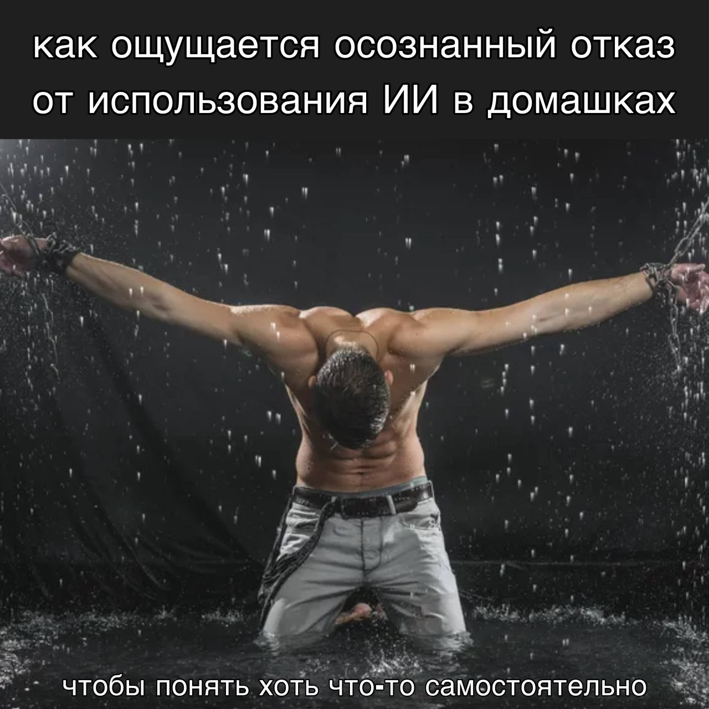

# Всем приветик

Меня зовут Марина, в этом репозитории я буду загружать домашние задания по предмету "Алгоритмы на языке Python", они будут находиться в папках с соответствующими названиями.

> Дисклеймер: все домашние задания в этом репозитории выполнены **без использования ИИ** поэтому схемы немного кривые, описание немного корявое и алгоритмы не самые оптимальные, надеюсь на понимание стремления к самостоятельной учебе

я даже мем сделала без использования ИИ. Я еще и потребляю меньше воды.

